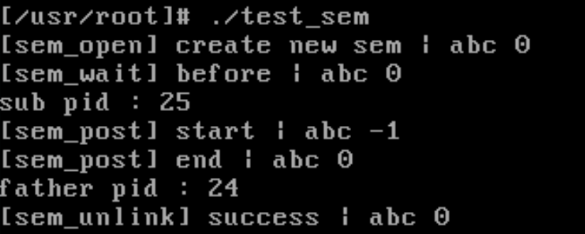

信号量结构体中定义一个阻塞队列，对于阻塞的进程先进先出。

test_sem.c 通过信号量实现子进程先打印，然后父进程后打印。

``` cpp
int main() {

    sem_t* abc = sem_open("abc", 0);
    int pid = fork();
    if (pid < 0) {
        printf("Failed to fork child process!\n");
        return -1;
    } else if (pid == 0) { 
        printf("sub pid : %d\n", getpid());
        sem_post(abc);
        return 0;
    }
    sem_wait(abc);
    printf("father pid : %d\n", getpid());
    sem_unlink("abc");
    
    return 0;
}
```


## 生产者消费者模型

** pc.c 运行结果分析 **

res.txt 感觉运行到后面的进程没有了时间片，从生产128开始，生产一个就马上消费了一个。

res2.txt 修改初始时间片15为30，修改优先级15为30。时间片问题没有解决，但是减缓了，生产到379才出现这个问题。

``` c
#define INIT_TASK \
/* state etc */	{ 0,30,30, \
/* signals */	0,{{},},0, \
/* ec,brk... */	0,0,0,0,0,0, \
/* pid etc.. */	0,-1,0,0,0, \
/* uid etc */	0,0,0,0,0,0, \
/* alarm */	0,0,0,0,0,0, \
/* math */	0, \
/* fs info */	-1,0022,NULL,NULL,NULL,0, \
/* filp */	{NULL,}, \
	{ \
		{0,0}, \
/* ldt */	{0x9f,0xc0fa00}, \
		{0x9f,0xc0f200}, \
	}, \
/*tss*/	{0,PAGE_SIZE+(long)&init_task,0x10,0,0,0,0,(long)&pg_dir,\
	 0,0,0,0,0,0,0,0, \
	 0,0,0x17,0x17,0x17,0x17,0x17,0x17, \
	 _LDT(0),0x80000000, \
		{} \
	}, \
}
```

res3.txt 修改先进先出机制。采用优先最大时间片出队列。时间片问题解决了，而且保证了不会有进程一直阻塞。原本想用堆优化查找时间复杂度，但是，在阻塞队列中，进程的时间片会在调度中动态改变，导致堆结构会被破坏。

``` c
int sys_sem_post(sem_t *sem) {
	/*
	printk("[sem_post] start | %s %d\n", sem->name, sem->value); 
	*/
	int p;
	struct task_struct * tmp, * head;
	cli();
	if (sem->value++  < 0) {
		p = sem->sp;
		head = sem->queue[sem->sp];
		while (p != sem->ep) {
			if (head->counter < sem->queue[p]->counter) {
				tmp = head;
				head = sem->queue[p];
				sem->queue[p] = tmp;
			}
			p = (p+1)%SEM_LEN;
		}
		head->state = TASK_RUNNING;
		sem->queue[sem->sp] = NULL;
		sem->sp = (sem->sp+1)%SEM_LEN;
	}
	sti();
	/*
	printk("[sem_post] end | %s %d\n", sem->name, sem->value); 
	*/
	
	return 0;
}
```