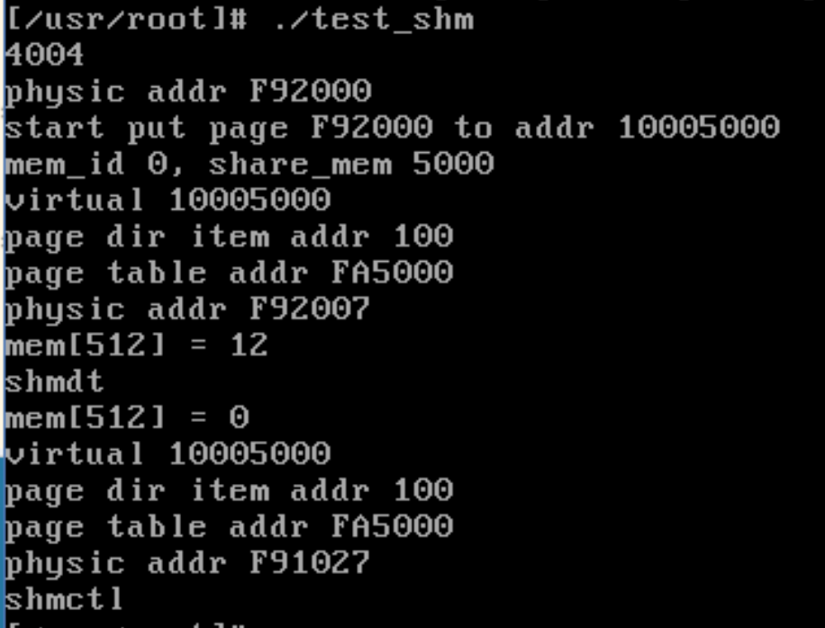

# 分段寻址

数据段的变量地址

由数据段的段基址+段内偏移得到

数据段基址如何得到？
ds寄存器存储的是LDT（局部描述符表）的段选择子
ldtr寄存器存储的是GDT（全局描述符表）的段选择子
gdtr寄存器存储了GDT表的地址。

通过gdtr可以找到GDT在哪里，然后通过ldtr的段选择子得到gdt中的一个段描述符，这个段描述符有64位，将基地址的位组合起来，得到一个地址，这个地址就是当前进程的LDT的首地址。


通过LDT的首地址得到LDT的位置，然后用ds段选择子得到数据段的首地址，

数据段的段基址+段内偏移 得到数据段变量的地址

以上的地址都是虚拟地址，需要通过分页机制找到物理地址。当然16MB内的地址通过分页得到的也是物理地址。

物理内存初始有1个页表目录和4个页表，预处理的4个页表目录项，和4个页表的值，使得16MB以内的虚拟地址都对应了对应的物理地址。


# 分页寻址
``` c
unsigned long put_page(unsigned long page,unsigned long address)
{
	unsigned long tmp, *page_table;

/* NOTE !!! This uses the fact that _pg_dir=0 */

	if (page < LOW_MEM || page >= HIGH_MEMORY)
		printk("Trying to put page %p at %p\n",page,address);
	if (mem_map[(page-LOW_MEM)>>12] != 1)
		printk("mem_map disagrees with %p at %p\n",page,address);
    // 页表目录有1024项, address 所在项的标号 id = address>>22
    // 每一项占用4字节，id项的指针是address高12位低两位为0，unsigned long *占用4字节
	page_table = (unsigned long *) ((address>>20) & 0xffc);
    // *page_table 寻址也要走分页机制？或许初始化时的几个页表解决了这个问题。前16MB虚拟地址映射到了对应物理地址上
	if ((*page_table)&1)
    // *page_table 是页表目录项的内容，高20位+第12位置为0,是页表首物理地址
		page_table = (unsigned long *) (0xfffff000 & *page_table);
	else {
		if (!(tmp=get_free_page()))
			return 0;
		*page_table = tmp|7;
		page_table = (unsigned long *) tmp;
	}
    // address 中间10位是定位到1024个页表项中某一个
	page_table[(address>>12) & 0x3ff] = page | 7;
/* no need for invalidate */
	return page;
}
```

虚拟地址0x12345678如何通过分页机制找到物理地址

`0b00010010001101000101011001111000`  
`0b0001001000 1101000101 011001111000`

虚拟地址高10位`0b0001001000`

`0b0001001000 = 72`，标号72,标号从0开始，所以是页表目录中1024项中的第73项

如何找到页表目录的73项？  
页表目录从物理0地址开始，占用了4kB,共1024项。每一项4Byte  
用(unsigned long*) 指针指向每一项，这些指针是4的倍数。

标号72项的指针为`0b000100100000`

该指针指向的值是该页表目录项的内容，这个内容是32为位的，将低12位置为0后就是页表的物理地址p。

虚拟地址接下来10位`0b1101000101` = 837

p[837]便是页表项内容，32位，第12位置为0为物理页首地址，物理页占用4kB，定位物理页中的每一个字节，可以用虚拟地址最后12位。

内核初始4KB是页表目录，接下来4个页表，映射了16MB虚拟地址到对应物理地址。
页表目录的前64个字，前4个字是四个页表目录项
``` 
<bochs:8> xp /64w 0
[bochs]:
0x00000000 <bogus+       0>:	0x00001027	0x00002007	0x00003007	0x00004027
0x00000010 <bogus+      16>:	0x00000000	0x000245d8	0x00000000	0x00000000
0x00000020 <bogus+      32>:	0x00000000	0x00000000	0x00000000	0x00000000
0x00000030 <bogus+      48>:	0x00000000	0x00000000	0x00000000	0x00000000
0x00000040 <bogus+      64>:	0x00ffe027	0x00000000	0x00000000	0x00000000
0x00000050 <bogus+      80>:	0x00000000	0x00000000	0x00000000	0x00000000
0x00000060 <bogus+      96>:	0x00000000	0x00000000	0x00000000	0x00000000
0x00000070 <bogus+     112>:	0x00000000	0x00000000	0x00000000	0x00000000
0x00000080 <bogus+     128>:	0x00ff3027	0x00000000	0x00000000	0x00000000
0x00000090 <bogus+     144>:	0x00000000	0x00000000	0x00000000	0x00000000
0x000000a0 <bogus+     160>:	0x00000000	0x00000000	0x00000000	0x00000000
0x000000b0 <bogus+     176>:	0x00000000	0x00000000	0x00000000	0x00ffb027
0x000000c0 <bogus+     192>:	0x00ff6027	0x00000000	0x00000000	0x00000000
0x000000d0 <bogus+     208>:	0x00000000	0x00000000	0x00000000	0x00000000
0x000000e0 <bogus+     224>:	0x00000000	0x00000000	0x00000000	0x00000000
0x000000f0 <bogus+     240>:	0x00000000	0x00000000	0x00000000	0x00ffa027
```

第一个页表前64字
```
<bochs:9> xp /64w 0x00001000
[bochs]:
0x00001000 <bogus+       0>:	0x00000067	0x00001027	0x00002007	0x00003007
0x00001010 <bogus+      16>:	0x00004007	0x00005067	0x00006067	0x00007027
0x00001020 <bogus+      32>:	0x00008027	0x00009027	0x0000a027	0x0000b027
0x00001030 <bogus+      48>:	0x0000c027	0x0000d027	0x0000e027	0x0000f027
0x00001040 <bogus+      64>:	0x00010027	0x00011027	0x00012027	0x00013027
0x00001050 <bogus+      80>:	0x00014027	0x00015027	0x00016027	0x00017027
0x00001060 <bogus+      96>:	0x00018027	0x00019027	0x0001a067	0x0001b067
0x00001070 <bogus+     112>:	0x0001c027	0x0001d067	0x0001e067	0x0001f067
0x00001080 <bogus+     128>:	0x00020067	0x00021067	0x00022067	0x00023067
0x00001090 <bogus+     144>:	0x00024067	0x00025067	0x00026067	0x00027067
0x000010a0 <bogus+     160>:	0x00028067	0x00029067	0x0002a067	0x0002b067
0x000010b0 <bogus+     176>:	0x0002c067	0x0002d067	0x0002e067	0x0002f067
0x000010c0 <bogus+     192>:	0x00030067	0x00031067	0x00032067	0x00033067
0x000010d0 <bogus+     208>:	0x00034067	0x00035067	0x00036067	0x00037067
0x000010e0 <bogus+     224>:	0x00038067	0x00039067	0x0003a067	0x0003b067
0x000010f0 <bogus+     240>:	0x0003c067	0x0003d067	0x0003e067	0x0003f067
```

第二个页表前64字
```
<bochs:10> xp /64w 0x00002000
[bochs]:
0x00002000 <bogus+       0>:	0x00400007	0x00401007	0x00402007	0x00403007
0x00002010 <bogus+      16>:	0x00404007	0x00405007	0x00406007	0x00407007
0x00002020 <bogus+      32>:	0x00408007	0x00409007	0x0040a007	0x0040b007
0x00002030 <bogus+      48>:	0x0040c007	0x0040d007	0x0040e007	0x0040f007
0x00002040 <bogus+      64>:	0x00410007	0x00411007	0x00412007	0x00413007
0x00002050 <bogus+      80>:	0x00414007	0x00415007	0x00416007	0x00417007
0x00002060 <bogus+      96>:	0x00418007	0x00419007	0x0041a007	0x0041b007
0x00002070 <bogus+     112>:	0x0041c007	0x0041d007	0x0041e007	0x0041f007
0x00002080 <bogus+     128>:	0x00420007	0x00421007	0x00422007	0x00423007
0x00002090 <bogus+     144>:	0x00424007	0x00425007	0x00426007	0x00427007
0x000020a0 <bogus+     160>:	0x00428007	0x00429007	0x0042a007	0x0042b007
0x000020b0 <bogus+     176>:	0x0042c007	0x0042d007	0x0042e007	0x0042f007
0x000020c0 <bogus+     192>:	0x00430007	0x00431007	0x00432007	0x00433007
0x000020d0 <bogus+     208>:	0x00434007	0x00435007	0x00436007	0x00437007
0x000020e0 <bogus+     224>:	0x00438007	0x00439007	0x0043a007	0x0043b007
0x000020f0 <bogus+     240>:	0x0043c007	0x0043d007	0x0043e007	0x0043f007
```

16MB（<0x01000000）内的线性地址直接是物理地址

p<0x01000000  
p>>22 < 0b100 = 0x4  
所以只需四个页表即可

测试几个小于16MB

0x00000001
页表目录0项 0x00001027
第一个页表的0项 0x00000067 ，后12位置为0，为4KB物理页首地址0x00000000
偏移1得到物理地址0x0000001

0x00401002

二进制
0000000001 0000000001 000000000010

页表目录项1号，页表项1号，得到0x00401007，末尾12位标志置为0,偏移2，得到物理地址0x00401002

绝妙

如何设置4个页表能做到这样？

共4096个页表项,标号i从0到4096，第i个项设置为i<<12，后面12位与上一些权限标志即可。
# 共享内存实现
``` c
#include<linux/shm.h>
#include<linux/mm.h>

shm_t shms[SHM_LEN];

/* 创建一页共享内存(如果key不存在)，key为共享内存的标识符(非0)，返回共享内存结构体的位置 */
int sys_shmget(int key) {
    int i;
    for (i=0; i<SHM_LEN; i++) {
        if (shms[i].key == key) {
            return i;
        }
    }
    for (i=0; i<SHM_LEN; i++) {
        if (shms[i].key == 0) {
            shms[i].key = key;
            shms[i].page = get_free_page();
            /*
            printk("physic addr %X\n", shms[i].page);
            */
            return i;
        }
    }
    return -1;
}
/* 将shm_t[id] 中物理内存 绑定到当前进程的 数据段基址+brk偏移地址 上， brk初始大小=代码段+数据段+bss段， brk大小加一页*/
void* sys_shmat(int id) {
    unsigned long p = get_base(current->ldt[2]) + current->brk;
    current->brk += PAGE_SIZE;
    /*
    printk("start put page %X to addr %X\n", shms[id].page, p);
    */
    put_page(shms[id].page, p);
    return (void *) current->brk - PAGE_SIZE; /*返回数据段的偏移量*/
}
/* 解绑定当前进程共享内存的虚拟地址，调用前确保之前有绑定*/
int sys_shmdt(int id) {
    unsigned long *pt, p = get_base(current->ldt[2]) + (current->brk -= PAGE_SIZE);
    /*
    printk("virtual %X\n", p);
    */
    pt = (unsigned long *) ((p>>20) & 0xffc); /* pt页表目录项指针*/
    /*
    printk("page dir item addr %X\n", pt);
    */
    pt = (unsigned long *) (0xfffff000 & *pt); /* pt页表首地址 */
    /*
    printk("page table addr %X\n", pt);
    printk("unlink addr %X\n", pt[(p>>12)&0x3ff]);
    */
    pt[(p>>12)&0x3ff] = 0; /*将对应项的 物理页首地址 置为空，这一页的虚拟地址不再映射物理地址*/
    return 0;
}

/* 删除共享内存 */
int sys_shmctl(int id) {
    if (shms[id].key != 0) {
        shms[id].key = 0;
        /*
        printk("start free page\n");
        */
        free_page(shms[id].page);
        shms[id].page = 0;
    }
    return 0;
}
```

测试共享内存系统调用

``` c
#include<stdio.h>
#include<linux/shm.h>


int mem_id;

int* share_mem;

int t=123;

int main() {
    printf("%X\n", &t);
    mem_id = shmget(123);
    share_mem = (int* )shmat(mem_id);
    printf("mem_id %d, share_mem %X\n", mem_id, share_mem);
    fflush(stdout);
    physic(share_mem);
    share_mem[512] = 12;
    printf("mem[512] = %d\n", share_mem[512]);
    fflush(stdout);
    shmdt(mem_id);
    printf("shmdt\n");
    fflush(stdout);
    printf("mem[512] = %d\n", share_mem[512]);
    physic(share_mem);
    shmctl(mem_id);
    printf("shmctl\n");
    fflush(stdout);
    return 0;
}


```


结果分析

shget在内核打印了 `physic addr F9C000`，申请了物理页的首地址`F9C00`

shmat 将虚拟地址`10005000`映射到物理地址`F9C000`，这个虚拟地址是数据段首地址+段内的偏移地址，数据段首地址是`10000000`，段内的偏移是`5000`，为什么是`5000`？在此之前包含了代码段数据段和bss段的长度。

share_mem这个指针的值是5000，说明用户代码所用的地址是段内的偏移地址。

写了一个系统调用，用于打印用户代码段的偏移地址，对应的虚拟地址，所在页表目录的目录项的地址，所在页表的页表首地址，映射的物理页首地址
``` c
int sys_physic(int addr) {
    unsigned long *pt, p = get_base(current->ldt[2]) + addr;
    /*
    */
    printk("virtual %X\n", p);
    pt = (unsigned long *) ((p>>20) & 0xffc); /* pt页表目录项指针*/
    /*
    */
    printk("page dir item addr %X\n", pt);
    pt = (unsigned long *) (0xfffff000 & *pt); /* pt页表首地址 */
    /*
    */
    printk("page table addr %X\n", pt);
    printk("physic addr %X\n", pt[(p>>12)&0x3ff]);
    return 0;
}
```
绑定的物理的地址是`F9C000`，解绑后再次访问`share_mem`，触发缺页中断，重新申请并映射到了新的物理页`F91000`，16进制后3个数是代表了二进制后12位，这些位都是标志位。映射的物理页都是4k对齐的。